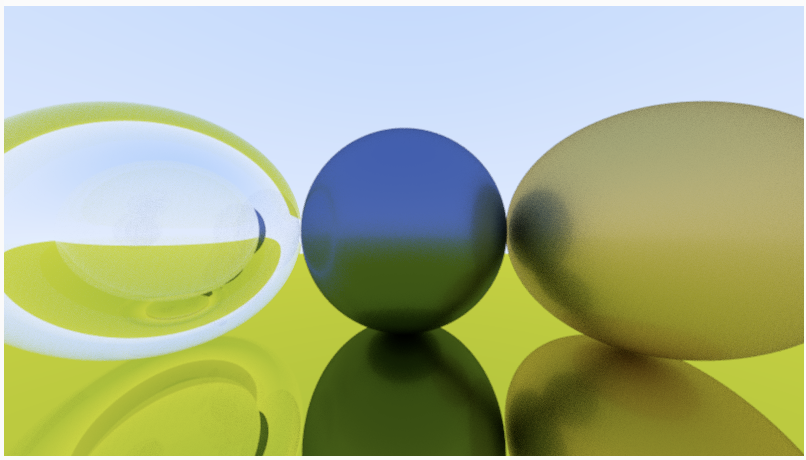

# raytracer

A GPU path tracer running live in the browser as a GLSL fragment shader,
driven by p5.js. Follows the ray-tracing model from *Ray Tracing in One
Weekend*, but instead of rendering on the CPU pixel-by-pixel in a loop, the
whole thing runs in parallel on the GPU every frame.


## How it works

**The setup (`sketch.js`, `shader.vert`)** just gets a full-screen quad onto
the GPU and hands every pixel its normalized position (`pos`) via a varying —
there's no JS-side ray logic at all. Scene data (sphere positions, radii,
materials, colors, fuzziness, index of refraction) is packed into arrays and
pushed to the shader as uniforms every frame.

**The actual ray tracer lives entirely in `shader.frag`**, run independently
for every pixel:

- **Camera** — a simple pinhole camera: rays are cast from a single origin
  through a virtual viewport plane, one ray direction per pixel (with per-sample
  jitter for anti-aliasing).
- **Intersection** — analytic ray–sphere intersection (`hit_sphere_at`), tested
  against every sphere in the scene, keeping the closest hit.
- **Materials** — three physically-based material models, dispatched by
  `mat_id`:
  - **Lambertian** (diffuse) — scatters in a random direction over the
    hemisphere around the surface normal
  - **Metal** — mirror-reflects the ray, with a `fuzz` parameter that jitters
    the reflection to fake roughness
  - **Dielectric** (glass) — refracts or reflects based on Snell's law and
    **Schlick's approximation** for reflectance at grazing angles, including a
    total-internal-reflection check. A hollow glass sphere is faked the usual
    way: a second sphere with inverted index of refraction (`1/ior`) nested
    inside the first.
- **Path tracing loop** — each ray bounces up to 50 times, accumulating color
  contributions multiplicatively per bounce, until it either escapes to the
  sky (a blue-to-white gradient) or is absorbed.
- **Anti-aliasing / noise reduction** — 100 randomly jittered samples per
  pixel are averaged per frame (Monte Carlo integration), which is also what
  keeps the render from looking speckly despite the random bounce directions.
- **Gamma correction** — final color is `sqrt`'d before output (approximate
  linear → gamma-2 conversion).

All randomness comes from a hash-based pseudo-random function (`random`,
`random_in_unit_sphere`) seeded off pixel position and sample index — there's
no texture-based noise source, it's pure math.

## Scene

The default scene in `sketch.js` sets up 5 spheres: a large ground sphere,
two metal spheres (one with fuzz for roughness), a glass sphere, and a hollow
glass sphere nested inside it (via the negative-IOR trick above). Materials,
colors, and fuzz are all just arrays passed as uniforms, so swapping in a new
scene is a matter of editing those arrays — no shader changes needed.

## Setup

The shader is loaded asynchronously (`loadShader`), which most browsers will
block over `file://` due to CORS. Serve the folder locally instead:

```bash
python3 -m http.server
```

then open `http://localhost:8000`.

## Structure

```
raytracer/
├── index.html      loads p5, p5.sound, and the sketch
├── style.css        full-bleed canvas
├── sketch.js         scene definition + uniform upload, one call per frame
├── shader.vert        passes through a full-screen quad
└── shader.frag         the actual path tracer — camera, intersection, materials, bounces
```

(`p5.js` / `p5_sound_min.js` are vendored copies of the p5.js library, not
part of the project code.)
